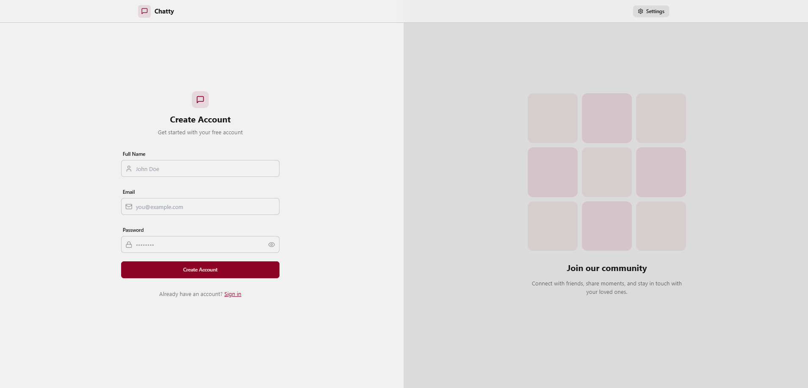
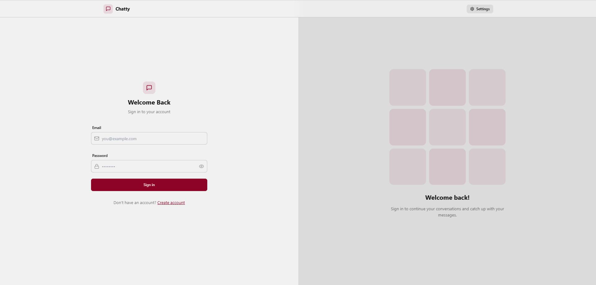
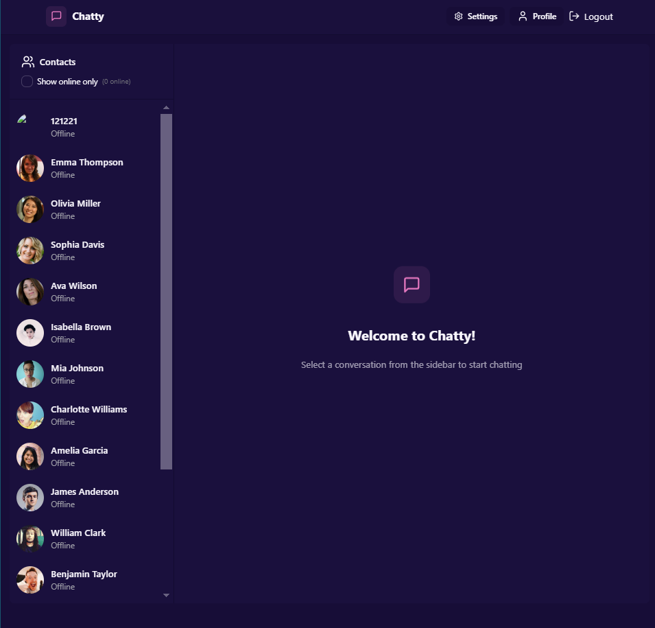
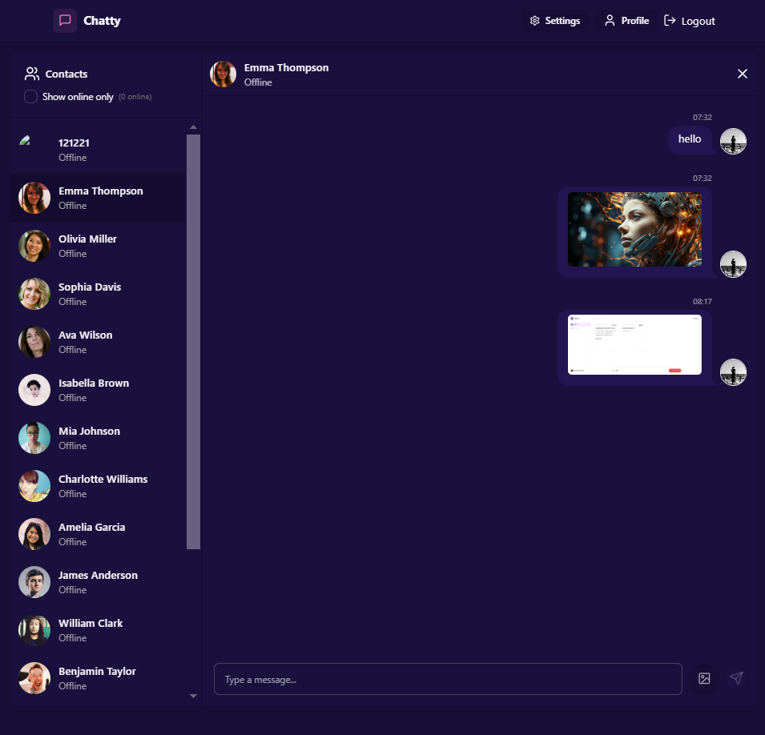
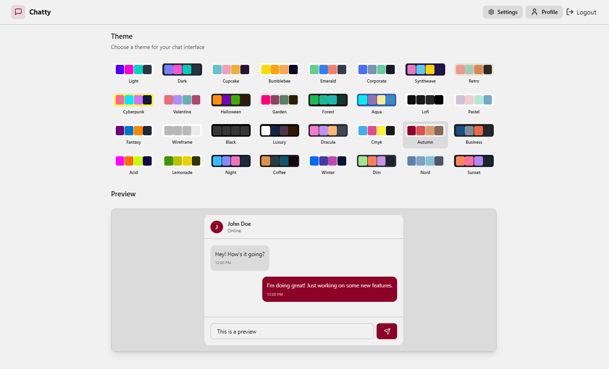
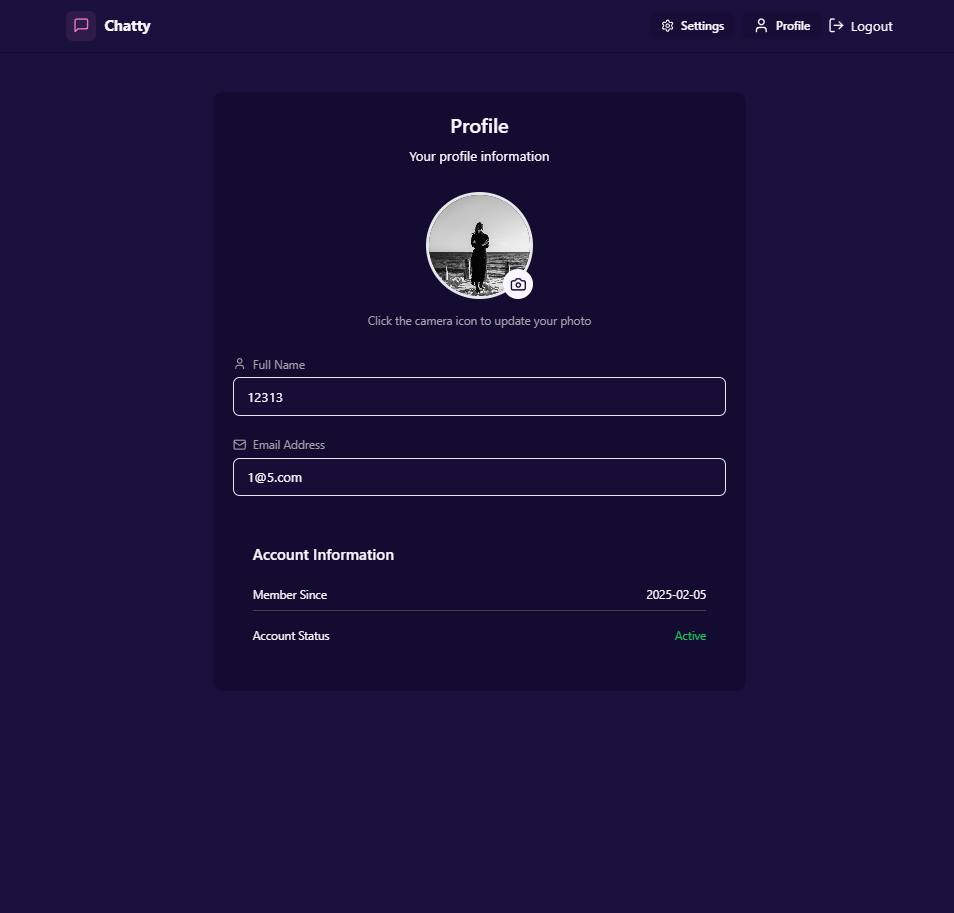

# Chatty: Real-Time Chat App

Chatty is a modern messaging platform built with the MERN stack, Socket.io, TailwindCSS, and Daisy UI. 
It enables users to communicate in real time, manage authentication securely, and enjoy a seamless chat experience.

## Deployed Website Link :

https://chatty-39pn.onrender.com

## Features

### Authentication & Authorization
- Secure user authentication using JWT.
- Role-based access control.

### Real-Time Messaging
- Instant messaging with Socket.io.
- Online user status indicator.
- Optimized message delivery and receipt.

### UI & UX
- Responsive and accessible design.
- Styled with TailwindCSS & Daisy UI.
- Multiple Themes support.

### Global State Management
- Zustand for managing global state efficiently.

### Deployment
- Free and optimized deployment setup.
- Scalable and production-ready configurations.

## Technologies Used

### Frontend
- React.js
- TailwindCSS & Daisy UI
- Zustand for state management

### Backend
- Node.js & Express.js
- MongoDB with Mongoose
- JWT Authentication
- Socket.io for real-time communication

### Deployment
- Configured for smooth production deployment.

## Screenshots

### SignUp Page

    

### Login Page

    

### Chat Page (First Page After Login)

    

### Messaging

    

### Multiple Themes Section

    

### Update Profile Image

    

## Future Improvements
- Group chat functionality.
- Voice and video call support.
- Message read receipts and typing indicators.
- End-to-end encryption for enhanced security.

Real-Time Chat App is designed to provide a fast, secure, and engaging chat experience. With real-time communication and modern UI/UX, it ensures a seamless messaging platform for users.
